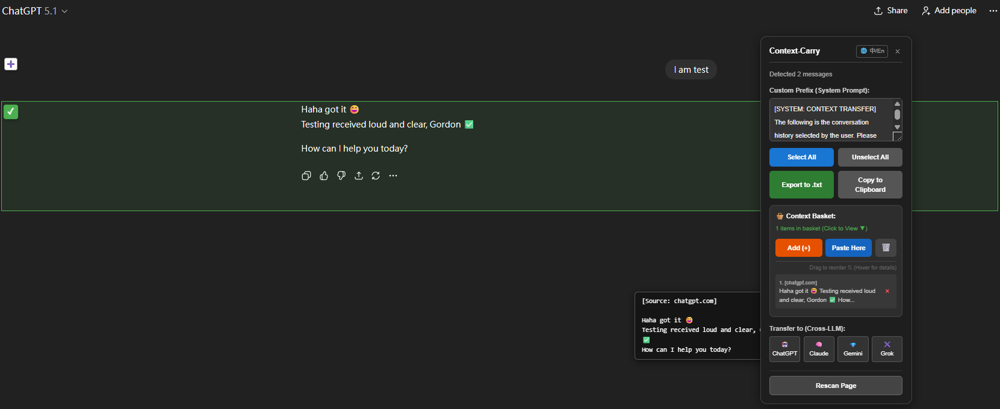

# Context-Carry: Cross-LLM Chat History Export & Context Manager

[](README_zh-TW.md)


**Stop losing your context when switching AIs.**

**Context-Carry** is a powerful Chrome extension designed for **Chat History Export**, **Prompt Management**, and **Seamless Cross-LLM Transfer**.

It allows you to effortlessly transfer conversation threads between different AI platforms (**ChatGPT**, **Claude**, **Gemini**, and **Grok**) with **One-Click Auto-Fill**.

Stop manually copying and pasting massive walls of text. Select specific messages, attach your custom system prompt, click a target platform, and watch it **automatically fill** the context in the new chat.

> **[點此查看中文說明 (Traditional Chinese Version)](README_zh-TW.md)**

## Features

- **Seamless Cross-LLM Transfer**: Instantly move context between ChatGPT 🤖, Claude.ai 🧠, Google Gemini 💎, and Grok ✖️.
- **Context Basket (New!)**: Collect conversation fragments from multiple windows/tabs into a staging area, then transfer them all at once.
- **Draggable Interface (New!)**: The panel is now draggable, so it never blocks your view.
- **Range Selection (New!)**: Use **Shift + Click** to instantly select a long list of messages.
- **Magic Auto-Fill**: Automatically opens the target AI platform and pastes your context.
- **Prompt Management**: Save custom system prompts to guide the AI.
- **Privacy First**: Runs 100% locally. Basket data is auto-cleared on browser restart.

## Screenshots



## Installation

### From Chrome Web Store
Coming soon.

### Manual Installation (Developer Mode)
1. Download the latest release source code or clone this repository.
2. Open Chrome and navigate to `chrome://extensions/`.
3. Toggle **Developer mode** in the top right corner.
4. Click **Load unpacked**.
5. Select the folder containing this extension's files.

## How to Use

1. Open a chat on any supported AI platform.
2. Click the **Context-Carry** icon.
3. **Select Messages**:
   - Click **➕** to select single messages.
   - **Hold Shift + Click** to select a range of messages.
4. **Transfer Options**:
   - **Direct Transfer**: Click a target platform icon (e.g., Gemini 💎) to open a new tab with the selected text.
   - **Context Basket (Multi-Window)**:
     1. Click **"Add (+)"** to save selection to the basket.
     2. Go to another tab/window and add more content if needed.
     3. Open the target AI window and click **"Paste Here"** to fill all collected content.
5. **Basket Management**: Click the arrow (▼) in the basket section to preview, drag-to-reorder, or delete items.

## Privacy

This extension respects your privacy.
- It operates entirely on the client side.
- It uses `chrome.storage` strictly for temporarily passing text between tabs for the auto-fill feature.
- It does **not** collect, store, or transmit any user data to external servers.
- See [PRIVACY.md](PRIVACY.md) for full details.

## Development

Pull requests are welcome. For major changes, please open an issue first to discuss what you would like to change.

Clone the repo:
   ```bash
   git clone https://github.com/gordonsay/Context-Carry.git
   ```

## Disclaimer

This extension is not affiliated with OpenAI, Anthropic, Google, or xAI.  
All product names, logos, and brands are property of their respective owners.

## Changelog

See [CHANGELOG.md](CHANGELOG.md) for a list of changes and updates.


## License

This project is licensed under the MIT License - see the [LICENSE](LICENSE) file for details.


## Contact

For questions or support, please open an issue on the [GitHub repository](https://github.com/gordonsay/Context-Carry).


## Note

Due to browser security restrictions, file attachments (PDF/Images) cannot be transferred automatically.
